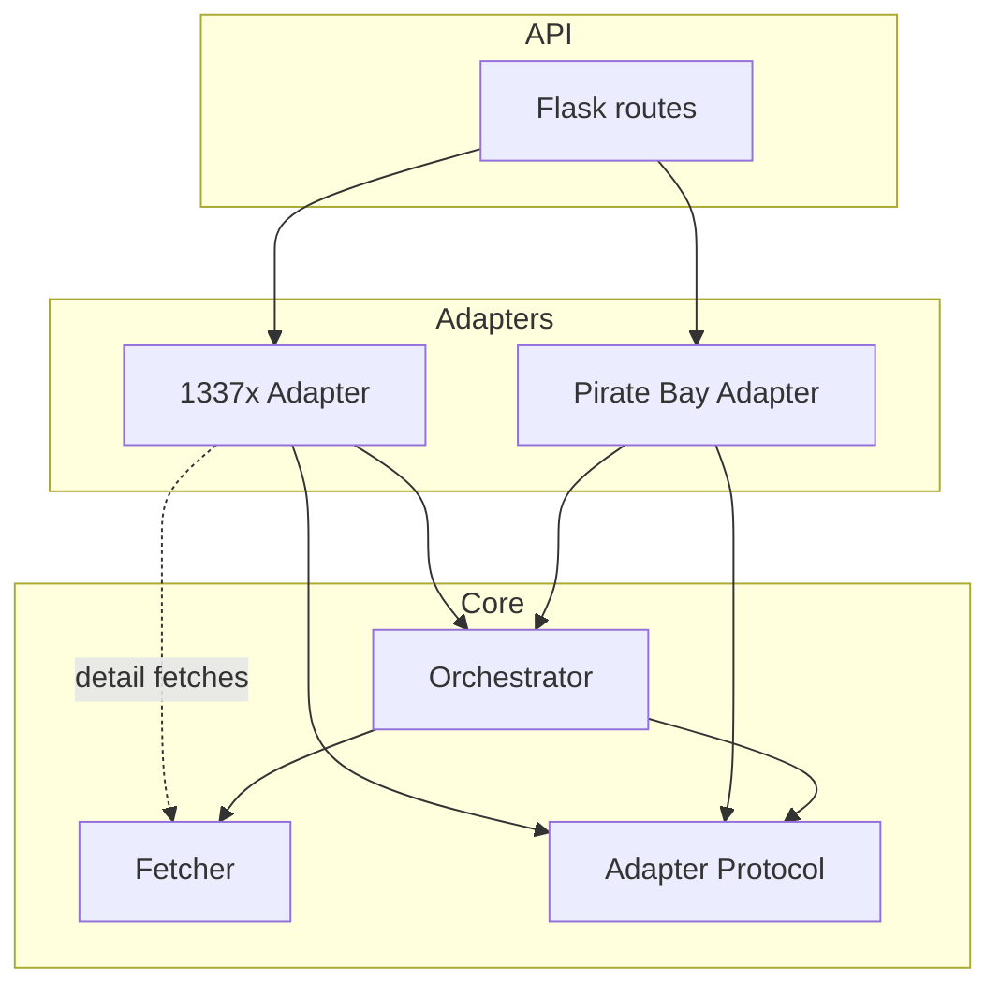

# 1337x-API

## Introduction

A modular, reusable **Playwright & BeautifulSoup** web-scraping API that fetches torrent information from both **1337x** and **The Pirate Bay**. The architecture is extensible, so new torrent sites can be added with minimal effort.

**Tech:** Fast headless Chrome via Playwright, BeautifulSoup parser, Flask/REST, clean Python ``Protocol`` adapters.

### Supported Sites
- **1337x** – table-based search + detail-page magnet/image fetch
- **The Pirate Bay** – list-based search with direct magnet extraction

**Returns:** name, magnet link, images, seeders, leechers, date, size, category, uploader, language, downloads, etc.

## Architecture




- **Fetcher** – Playwright + BeautifulSoup (headless Chrome, configurable timeout, `wait_until`).
- **Protocol** – Simple interface: `build_search_url()`, `validate_page()`, `scrape_search_page()`. 
- **Orchestrator** – DRY workflow that handles fetch + errors + standard output for all sites.
- **Adapters** – Site-specific logic: URL building, selectors, two-phase scraping (if detail pages needed).
- **Easy Extension** – Add a new torrent site by writing one adapter and one thin api.py wrapper.

## Usage

You can use this API in the following ways:

1. **Pirate Bay – search by name & page (0-based):**
```bash
GET /pirate-bay/<query>/<int:pgno>
GET /pirate-bay/<query>
GET /pirate-bay/?q=<query>&page=<pgno>
```

2. **1337x – search by name & page (1-based):**
```bash
GET /1337x/<query>/<int:pgno>  
GET /1337x/<query>
GET /1337x/?q=<query>&page=<pgno>
```

Default ports:
- Local dev: `127.0.0.1:5000`
- Docker: `0.0.0.0:8000`

## Environment

| Component | Technology | Purpose |
|-----------|------------|---------|
| Browser | Playwright/Chrome (headless) | JS-heavy pages, waits until network-idle |
| Parser | BeautifulSoup 4 | Fast, readable scraping outside browser |
| Framework | Flask + **Flask-RESTful** (or **FastAPI***) | Lightweight API endpoints |
| Adapter Pattern | Python Protocol | OCP-ready; thin per-site plugins |

*Future upgrade suggestion

## Quick Start (Docker)
```bash
docker build -t 1337x-api .
docker run -p 8000:8000 1337x-api
```
**Visit:** `http://127.0.0.1:8000`

---
## Local Dev
```bash
python -m venv venv
source venv/bin/activate
pip install -r requirements.txt
python app.py  # runs on :5000
```

## How to Add a New Site (Extending the Protocol)

1. Create `sites/<site_name>/adapter.py`:  

```python
from typing import Callable, List
from bs4 import BeautifulSoup
from core.protocol import TorrentSiteAdapter

class NewSiteAdapter(TorrentSiteAdapter):
    BASE_URL = "https://..."
    
    def build_search_url(self, query: str, page: int) -> str:
        return f"{self.BASE_URL}/search?q={query}&p={page}"

    def validate_page(self, pgno) -> int:
        # coerce to int, set fallback/default, etc
        ...

    def scrape_search_page(self, soup, fetch_html, user_agent) -> List[dict]:
        # find results, extract fields, map to standard JSON schema
        # optional: fetch extra URLs via `fetch_html(url)` and append details
        ...
```

2. Create `sites/<site_name>/api.py`: wrap orchestrator call in existing `fetch` signature:

```python
from core.orchestrator import fetch_site
from sites.<site_name>.adapter import NewSiteAdapter

adapter = NewSiteAdapter()
def fetch(query, pgno=0, userAgent=...):
    return fetch_site(adapter, query, pgno, userAgent)
```

3. Register route in `app.py` and done.

## JSON Response Schema